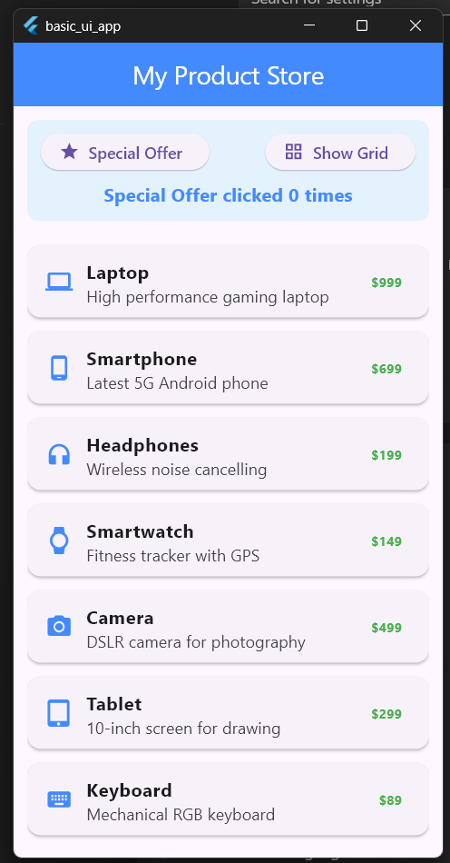
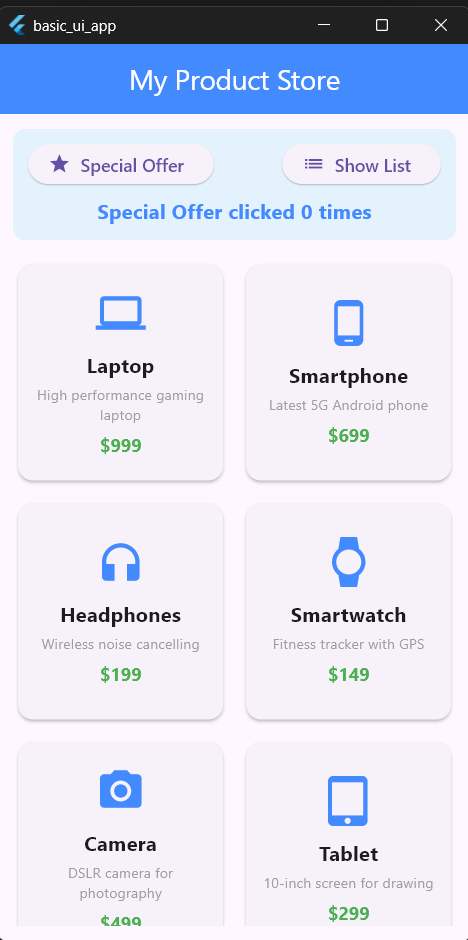

# Assignment 6: Basic UI using Flutter

This project is developed as **Assignment 6** for the Flutter course. The objective of this assignment is to demonstrate the use of basic Flutter UI widgets, layouts, scrolling views, user interactions, and Material Design components by creating a simple Product Catalog application.

## 📝 Features Included

This assignment includes the following Flutter concepts:

* **ListView.builder**

  * Displays the product catalog in a vertically scrollable list.
  * Each product is shown inside a `Card` using a `ListTile`.

* **GridView.builder**

  * Displays the same products in a 2-column grid layout.
  * Each product is presented inside a `Card`.

* **Card Widget**

  * Used to organize product information with rounded corners and elevation for a clean Material Design look.

* **ListTile**

  * Shows the product icon, name, description, and price in the list view.

* **InkWell & Item Click**

  * Grid items are wrapped with `InkWell` to provide a ripple animation when tapped.
  * Selecting any product displays a `SnackBar` showing the selected item's name.

* **Button Functionality**

  * **Special Offer Button:** Increases the click counter and displays a `SnackBar`.
  * **Show List / Show Grid Button:** Switches between List View and Grid View dynamically.

* **State Management**

  * Uses `StatefulWidget` to manage:

    * View mode (List/Grid)
    * Button click counter

* **Spacing & Layout**

  * Implemented using `Padding`, `SizedBox`, `Column`, and `Expanded` for proper alignment and responsive layout.

* **Material Theme**

  * Uses `ColorScheme.fromSeed` with blue accents to provide a consistent application theme.

* **Smooth Scrolling**

  * Both `ListView.builder` and `GridView.builder` are placed inside an `Expanded` widget to avoid layout overflow issues.

---

## 🚀 How to Run the Project

1. Make sure Flutter is installed:

   ```bash
   flutter doctor
   ```

2. Open the project directory:

   ```bash
   cd project_path
   ```

3. Run the application:

   ```bash
   flutter run
   ```

---

## 📂 Project Structure

The complete implementation is available in:

```text
lib/
 └── main.dart
```

### Main Components

* **Product**

  * A simple model class containing product details such as name, description, price, and icon.

* **MyApp**

  * Configures the `MaterialApp` and application theme.

* **ProductCatalogScreen**

  * A `StatefulWidget` that manages the product list, button clicks, and switching between List View and Grid View.

* **_buildListView()**

  * Builds the scrollable product list.

* **_buildGridView()**

  * Builds the scrollable product grid.

---

## 📸 Output Screenshots

Below are the screenshots.If not loaded properly please check in the `assets/` folder with the filenames `list_view_screenshot.png` and `grid_view_screenshot.png`.

<div align="center" style="display: flex; justify-content: center; gap: 20px; flex-wrap: wrap; margin-top: 20px;">

  <!-- List View Screenshot Card -->

  <div style="border: 2px solid #e0e0e0; border-radius: 12px; padding: 10px; box-shadow: 0 4px 6px rgba(0,0,0,0.1); background-color: #ffffff; max-width: 320px;">
    <h3 style="color: #2196F3; margin-top: 0;">1. List View Mode</h3>
    
    <p style="font-size: 13px; color: #757575; margin-top: 10px; line-height: 1.4;">
      Shows products in a list using <code>ListView.builder</code>, <code>Card</code>, and <code>ListTile</code>.
    </p>
  </div>

  <!-- Grid View Screenshot Card -->

  <div style="border: 2px solid #e0e0e0; border-radius: 12px; padding: 10px; box-shadow: 0 4px 6px rgba(0,0,0,0.1); background-color: #ffffff; max-width: 320px;">
    <h3 style="color: #2196F3; margin-top: 0;">2. Grid View Mode</h3>
    
    <p style="font-size: 13px; color: #757575; margin-top: 10px; line-height: 1.4;">
      Shows products in a grid using <code>GridView.builder</code> and <code>InkWell</code> for click ripple effect.
    </p>
  </div>

</div>
